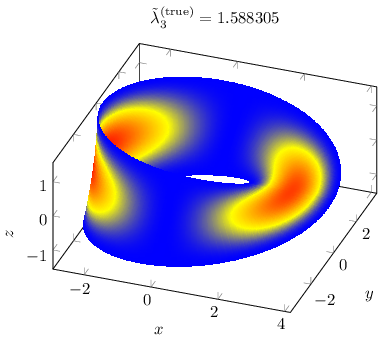

# Effective quantum dynamics on the Möbius strip

[](https://travis-ci.com/kalvotom/moebius)

*Tomáš Kalvoda, David Krejčiřík, Kateřina Zahradová*



## Requirements

In order to use this code you have to have [Julia](https://www.julialang.org) installed.
The code is tested on Julia version 1.2. 
Figures are created by powerful LaTeX [PGFPlots](https://ctan.org/pkg/pgfplots) package, so you should have working LaTeX installation and PGFPlots available.

## Usage

First of all clone this repository.
In the repository directory activate the Julia project and install its dependencies, i.e. change the directory and run

```
$ julia --project=@.
```

then activate the Package manager by pressing `]` in the Julia command prompt.
Finally install dependencies

```
(moebius) pkg> instantiate
```

All computations are run and figures are created by executing

```
$ make
```

## Contact

If you have any questions or suggestions please feel free to create [an issue in this repository](https://github.com/kalvotom/moebius/issues/new) or send an email to [Tomáš Kalvoda](mailto:tom.kalvoda@gmail.com).
